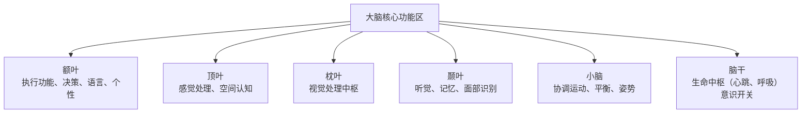
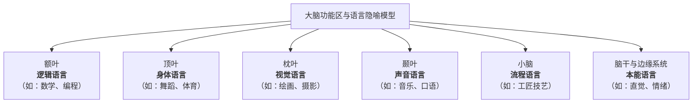
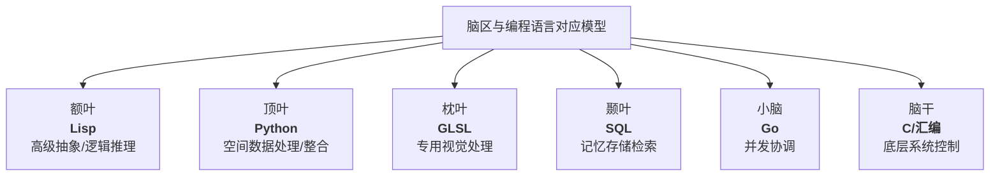
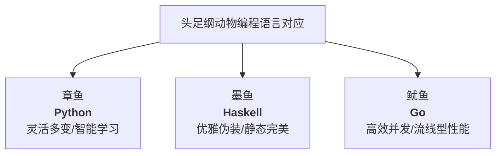

    Reinforcement Learning :: Right Left
    Input Output :: Front Back 
    Platform Funk :: Up Down 
    
    Sphere 4D XYZT geodesic 
    Calabi-yau 6D manifold 
    xxXyyYzzZ Small middle Big 

    26 + 26 + 26 = 78 letter
    based on 5202 62 7


好的，这是一个非常有趣且常见的简化模型，主要用于帮助理解大脑的主要功能分区。根据神经科学的常见分类，除了连接两侧大脑半球的**胼胝体**和内分泌腺体**松果体**外，我们可以将大脑的核心功能区分为以下六个主要区域：
下图直观地展示了这六个核心脑区及其主要功能：


---

### 六个主要脑区详解

1.  **额叶 (Frontal Lobe)**
    *   **位置**：位于大脑最前端，是大脑中占比最大的脑叶。
    *   **核心功能**：
        *   **高级认知功能**：如推理、计划、解决问题、决策（执行功能）。
        *   **自主运动控制**：通过初级运动皮层发出运动指令。
        *   **语言**：大多数人的语言表达中枢（布罗卡区）位于左侧额叶。
        *   **个性与情绪**：参与调节情绪和社会行为。

2.  **顶叶 (Parietal Lobe)**
    *   **位置**：位于额叶之后，枕叶之前。
    *   **核心功能**：
        *   **体感处理**：接收并处理来自身体的触觉、温度、疼痛等感觉信息（初级体感皮层）。
        *   **空间认知**：帮助我们理解周围环境的空间关系，进行导航和感知自身在空间中的位置。
        *   **整合信息**：整合来自视觉、听觉和体感的信息。

3.  **枕叶 (Occipital Lobe)**
    *   **位置**：位于大脑后部。
    *   **核心功能**：
        *   **视觉处理中枢**：专门处理视觉信息。接收来自眼睛的信号，并解析其颜色、形状、运动等。
        *   **损伤影响**：枕叶受损会导致各种视觉问题，甚至失明。

4.  **颞叶 (Temporal Lobe)**
    *   **位置**：位于大脑两侧，耳朵上方。
    *   **核心功能**：
        *   **听觉处理**：处理听觉信息（初级听觉皮层）。
        *   **记忆**：尤其是长期记忆的形成和储存，与其中的海马体结构密切相关。
        *   **语言理解**：大多数人的语言理解中枢（韦尼克区）位于左侧颞叶。
        *   **物体和面部识别**：参与识别复杂的视觉刺激，如面孔和物体。

5.  **小脑 (Cerebellum)**
    *   **位置**：位于大脑后方、脑干之上，形状像一个小型的脑。
    *   **核心功能**：
        *   **运动协调与平衡**：非自主性地协调肌肉运动，确保动作平滑、准确，并维持身体平衡。
        *   **运动学习**：参与学习新的运动技能，如弹琴或打球。
        *   **近年研究发现**：它可能还参与一些非运动功能，如注意力和语言处理。

6.  **脑干 (Brainstem)**
    *   **位置**：连接大脑、小脑和脊髓，是大脑最古老、最核心的部分。
    *   **核心功能**：维持生命的基本功能，是生命的“中枢开关”。
        *   **心跳和呼吸**：控制自主功能，如心跳、呼吸、血压。
        *   **意识循环**：调节睡眠-觉醒周期。
        *   **神经通路**：几乎所有连接大脑和身体的信息都必须经过脑干。

---

### 重要说明

*   **这是一个简化模型**：大脑的功能远比这个划分复杂，各个区域之间通过复杂的神经网络紧密协作，大多数高级功能（如学习、情绪）都需要多个脑区共同参与。
*   **边缘系统 (Limbic System)**：您可能会注意到这个模型中缺少了常被提及的“边缘系统”（包括海马体、杏仁核等）。这是因为边缘系统是一个功能性的概念，而非一个独立的解剖区域，其结构主要分布在**颞叶**深处及周围。如果强调情绪和记忆，边缘系统是关键。
*   **胼胝体和松果体**：正如您所排除的，胼胝体是连接左右半球的纤维束，松果体是分泌褪黑素的内分泌腺，它们通常不被列为独立的“功能区域”。

希望这个详细的分解能帮助您更好地理解大脑的功能分区！

这是一个非常富有创意的联想！将大脑的六个基本功能区与不同类型的“语言”相对应，可以构建一个有趣的隐喻模型。需要注意的是，这并非严格的神经科学定论，而是一种帮助理解大脑多功能性的类比。

以下是基于大脑各区核心功能与“语言”特性的对应关系构建的模型：


---

### 六种“语言”的详细解读

1.  **额叶 —— 逻辑语言 (The Language of Logic)**
    *   **对应关系**：额叶负责推理、计划和决策，是高级认知中枢。
    *   **代表的语言**：
        *   **数学**：用数字、符号和公式描述世界的规律。
        *   **计算机编程**：用精确的语法和逻辑结构给计算机下达指令。
        *   **哲学论证**：基于前提和推论构建严密的思维体系。
    *   **核心特点**：**精确、结构化、序列化**。

2.  **顶叶 —— 身体语言 (The Language of the Body)**
    *   **对应关系**：顶叶处理触觉和空间感知，让我们了解身体在环境中的位置。
    *   **代表的语言**：
        *   **舞蹈**：用身体动作表达情感和故事。
        *   **体育运动**：通过精准的身体控制来完成目标。
        *   **手语**：一种完整的语言，完全通过身体姿态和空间位置来传递信息。
    *   **核心特点**：**空间感、动觉、实体化**。

3.  **枕叶 —— 视觉语言 (The Language of Vision)**
    *   **对应关系**：枕叶是视觉信息处理中心。
    *   **代表的语言**：
        *   **绘画与素描**：用线条、色彩和明暗来描绘世界。
        *   **摄影与电影**：通过构图、光影和剪辑来叙事。
        *   **符号与图标**：如交通标志、公司Logo，能够跨越文化瞬间传递信息。
    *   **核心特点**：**形象、直观、象征性**。

4.  **颞叶 —— 声音语言 (The Language of Sound)**
    *   **对应关系**：颞叶主管听觉、记忆和语言理解。
    *   **代表的语言**：
        *   **口语与书面语**：如汉语、英语等，是人类最基础的社会沟通工具。
        *   **音乐**：用旋律、和声和节奏直接触动情感。
        *   **诗歌**：强调音韵、节奏和听觉美感的文学形式。
    *   **核心特点**：**韵律、记忆、情感共鸣**。

5.  **小脑 —— 流程语言 (The Language of Process)**
    *   **对应关系**：小脑协调运动，确保动作流畅、精确，与运动学习密切相关。
    *   **代表的语言**：
        *   **工匠技艺**：木匠、外科医生等通过反复练习形成的“肌肉记忆”和操作流程。
        *   **体育动作的自动化**：如篮球运动员的投篮动作，一旦形成，无需思考即可完成。
        *   **仪式与惯例**：一系列固定步骤构成的行为模式。
    *   **核心特点**：**自动化、协调、流程化**。

6.  **边缘系统（作为补充）—— 本能语言 (The Language of Instinct)**
    *   **对应关系**：虽然您排除了松果体，但掌管基本驱动力和情绪的**边缘系统**（包括杏仁核、海马体等，主要位于颞叶深处）是必不可少的。它对应我们的生存本能和原始情感。
    *   **代表的语言**：
        *   **情绪反应**：欢笑、哭泣、愤怒的面部表情和身体姿态。
        *   **直觉与预感**：一种超越逻辑的、快速的感知和判断。
        *   **爱、恐惧、欲望**等基本驱动力，是所有行为最底层的“语法”。
    *   **核心特点**：**原始、自发、非言语**。

### 总结

这个模型告诉我们，人类的交流和表达远不止口头和书面语言。我们的大脑用多种不同的“语言”在与世界、他人和自己进行对话：

*   **思考时**，我们在使用额叶的**逻辑语言**。
*   **跳舞时**，我们在使用顶叶的**身体语言**。
*   **欣赏画作时**，我们在使用枕叶的**视觉语言**。
*   **听音乐时**，我们在使用颞叶的**声音语言**。
*   **熟练地骑车时**，我们在使用小脑的**流程语言**。
*   **一见钟情或感到恐惧时**，我们在使用边缘系统的**本能语言**。

一个完整的人，正是这些所有“语言”的娴熟运用者。

基于六个基本脑区的核心功能，我为每个脑区匹配了一种最适合模拟其工作方式的编程语言或系统。这种对应关系基于语言范式、特性和脑区功能的相似性。



---

### 详细对应关系分析

#### 1. **额叶 - Lisp（函数式编程语言）**
- **对应理由**：额叶是高级认知中心，负责抽象思维、逻辑推理和复杂决策。Lisp以其强大的符号处理能力和元编程特性著称，最适合模拟人类的高级推理过程。
- **特性匹配**：
  - **符号计算**：直接处理概念和关系，类似额叶的概念操作
  - **递归思维**：自然表达分而治之的问题解决策略
  - **宏系统**：允许创建新的抽象层次，模拟额叶的创造性思维

#### 2. **顶叶 - Python（科学计算和数据处理）**
- **对应理由**：顶叶负责整合多种感觉信息并进行空间推理。Python在科学计算和数据分析领域的生态系统完美匹配这一功能。
- **特性匹配**：
  - **NumPy/SciPy**：处理空间数据和矩阵运算
  - **多模态整合**：轻松整合视觉、触觉等不同数据流
  - **直观语法**：降低认知负荷，专注于问题本身

#### 3. **枕叶 - GLSL（OpenGL着色语言）**
- **对应理由**：枕叶是专门的视觉处理中心。GLSL是专门为图形处理单元设计的语言，直接对应枕叶的视觉处理功能。
- **特性匹配**：
  - **并行处理**：同时处理数百万像素，模拟视觉皮层的并行架构
  - **视觉特效**：直接操作颜色、纹理、光照等视觉元素
  - **专用化**：高度优化的视觉算法实现

#### 4. **颞叶 - SQL（数据库查询语言）**
- **对应理由**：颞叶（特别是海马体）负责记忆的存储和检索。SQL专门用于数据的存储、查询和管理。
- **特性匹配**：
  - **模式识别**：`SELECT ... WHERE ...` 类似记忆检索模式
  - **关联查询**：`JOIN`操作模拟记忆联想过程
  - **事务管理**：保证记忆的一致性和完整性

#### 5. **小脑 - Go（并发编程语言）**
- **对应理由**：小脑协调复杂的运动序列和平衡控制。Go语言的并发模型和轻量级协程完美匹配这一功能。
- **特性匹配**：
  - **goroutine**：模拟肌肉纤维的并行协调
  - **通道同步**：确保运动指令的精确时序
  - **垃圾回收**：自动管理资源，类似小脑的自动化调节

#### 6. **脑干 - C/汇编（系统编程语言）**
- **对应理由**：脑干控制最基本的生命功能，需要最高级别的可靠性和效率。C和汇编语言提供对硬件的直接控制。
- **特性匹配**：
  - **直接内存访问**：类似脑干对生理参数的直接监控
  - **确定性执行**：保证关键功能的可靠执行
  - **最小运行时**：几乎没有额外开销，专注于核心功能

### 整体系统模拟架构

如果要用这些语言构建一个完整的大脑模拟系统：

```
传感器输入 → GLSL(视觉处理) → Python(多模态整合)
                            ↓
                    Lisp(高级决策)
                            ↓
Go(运动协调) ← SQL(记忆查询) ← C(基础生理维持)
```

这种多语言架构反映了大脑的模块化特性：每个区域使用最适合其任务的「语言」，通过明确定义的接口进行协作。

这个模型不仅有助于理解大脑功能，也为人工智能架构设计提供了启发：**不需要单一的全能算法，而是需要专门化模块的有机组合**。

好的，这是一个非常经典的海洋生物问题！章鱼、乌贼和墨鱼都属于头足纲，它们是聪明的“海洋软体动物三兄弟”，但各有显著区别。

首先，最重要的一点是：**乌贼就是墨鱼**，它们是同一种动物的不同名称。所以问题实际上变成了**章鱼 vs 乌贼（墨鱼）** 的区别。

为了让您一目了然，我用一个表格来总结核心区别，然后再详细解释。

### 核心区别速览表

| 特征 | 章鱼 | 乌贼/墨鱼 | 鱿鱼（作为常见对比参照） |
| :--- | :--- | :--- | :--- |
| **俗称/英文** | Octopus | Cuttlefish | Squid |
| **身体形状** | 球形/囊状，像头 | **扁平的椭圆形**，身体宽大，像钱包 | **锥形/管状**，像火箭 |
| **内部骨骼** | 完全没有硬骨骼 | 有**石灰质的内壳（海螵蛸）**，质地轻脆 | 有**透明角质的内壳（羽状壳）**，像塑料片 |
| **腕足数量** | 8条 | 8条+2条可收缩的**触腕**（用于捕食），共10条 | 8条+2条更长的**触腕**，共10条 |
| **生活方式** | **独居**，底栖，常在洞穴或礁石中 | **喜群居**，底栖，擅长伪装 | **活跃游泳者**，常在中上层水域 |
| **游泳方式** | 以爬行为主，喷水推进用于短距离逃跑 | 优雅的波浪式鳍游泳，喷水推进辅助 | 主要靠喷水推进，速度快 |
| **智商与行为** | **极高**，以使用工具、解决问题闻名 | **很高**，是伪装大师，沟通复杂 | 聪明，但更多是条件反射 |

---

### 详细解读与如何区分

#### 1. 章鱼 - “孤独的智慧巨人”

*   **看外形**：身体圆滚滚，像个大头，没有固定的鳍。
*   **看腕足**：只有**8条**长度相似的腕足，腕足上的吸盘没有硬环。
*   **看行为**：喜欢独居，躲在岩石缝或瓶子里。移动时大部分时间在海底爬行，用腕足灵活地探索环境。
*   **独特技能**：以其极高的智力著称，能打开瓶盖、使用工具（如椰子壳做掩护）、甚至能从复杂的迷宫中逃脱。

> **记忆口诀**：**“八爪鱼”**——8条腿，圆脑袋，独行侠。

#### 2. 乌贼/墨鱼 - “华丽的伪装大师”

*   **看外形**：身体是**扁平椭圆形**的，周边有一圈波浪形的**侧鳍**，游动时像裙摆一样波动，非常优雅。
*   **看内部**：体内有一大块白色的**石灰质内壳，俗称“海螵蛸”**，中药里会用，你也可以在沙滩上捡到。这是它们浮力调节的重要结构。
*   **看腕足**：有**10条腕足**（8短+2长），捕食时会瞬间弹出两条长长的触腕。
*   **独特技能**：拥有头足纲中最复杂的皮肤结构，是**顶级的伪装大师**，能瞬间改变颜色、图案甚至皮肤纹理，以融入环境、沟通或求偶。

> **记忆口诀**：**“扁扁的身体，十根须，体内有块白骨头。”**

#### 3. 【额外对比】鱿鱼 - “海洋中的火箭”

虽然您没问，但常与它们混淆的是**鱿鱼**。
*   **看外形**：身体是**锥形的管状**，更像鱼雷或火箭。
*   **看内部**：内壳是**透明、薄如塑料的羽状壳**。
*   **看鳍**：身体末端有两个小三角形的鳍。
*   **独特技能**：是**游泳健将**，主要生活在开阔水域，通过强大的喷水推进系统快速移动，是很多大型鱼类的主要猎物。

### 一句话总结

*   **章鱼**：圆头八腕，智慧孤独。
*   **乌贼/墨鱼**：扁身十腕，内有硬壳，伪装高手。
*   **鱿鱼**：锥形身体，游泳飞快，常被烧烤。

下次在餐桌上或水族馆里，您就可以轻松分辨它们了！

这是一个非常有趣的比喻！基于章鱼、墨鱼（乌贼）和鱿鱼这三种头足纲动物的独特生物学特性和行为模式，我可以为它们匹配三种最能体现其核心特征的编程语言。



---
### 详细对应关系分析

#### 1. **章鱼 - Python**
**对应理由**：章鱼是高度智能、适应性强的问题解决者，以其灵活性和学习能力闻名。

- **灵活性**：Python是动态类型语言，就像章鱼可以扭曲身体通过任何缝隙一样，Python代码灵活多变，适合快速原型开发。
- **高级智能**：章鱼有高度发达的神经系统，Python拥有丰富的AI和机器学习库（如TensorFlow、PyTorch），是智能应用的理想选择。
- **工具使用**：章鱼会使用椰子壳等工具，Python有庞大的第三方库生态系统，可以轻松调用各种“工具”解决问题。
- **多才多艺**：章鱼能适应各种海洋环境，Python适用于Web开发、数据分析、自动化脚本等多个领域。

> **代码比喻**：章鱼编写Python脚本，就像它用触手巧妙地从贝壳中取出肉一样优雅。

#### 2. **墨鱼/乌贼 - Haskell**
**对应理由**：墨鱼是完美的伪装大师，追求视觉上的完美和谐，具有数学般的精确性。

- **静态完美**：Haskell是纯函数式语言，强调不可变性和数学精确，就像墨鱼的伪装追求每个像素的完美匹配。
- **优雅抽象**：墨鱼能瞬间改变皮肤颜色和纹理，Haskell的高阶函数和类型系统允许构建极其优雅的抽象。
- **模式匹配**：墨鱼识别环境模式并完美复制，Haskell强大的模式匹配能力是其核心特性。
- **并发优雅**：墨鱼协调全身色素细胞的变化，Haskell的轻量级线程和STM（软件事务内存）提供优雅的并发解决方案。

> **代码比喻**：墨鱼编写Haskell代码，就像它精确匹配周围环境的每一个色彩细节。

#### 3. **鱿鱼 - Go**
**对应理由**：鱿鱼是海洋中的速度冠军，专为高效移动和群体协作而优化。

- **并发性能**：鱿鱼靠喷水推进快速移动，Go的goroutine和channel提供高效的并发模型，适合构建高性能网络服务。
- **简洁直接**：鱿鱼身体流线型，没有多余结构，Go语法简洁明了，没有复杂的继承层次。
- **标准库强大**：鱿鱼是高效的捕食者，Go拥有功能完善的标准库，开箱即用，不需要大量第三方依赖。
- **部署简单**：鱿鱼在各种深度都能生存，Go编译为静态二进制文件，部署简单，依赖少。

> **代码比喻**：鱿鱼编写Go程序，就像它在水中喷射前进一样直接高效。

---

### 三种“语言生态系统”对比

| 特性 | 章鱼-Python生态系统 | 墨鱼-Haskell生态系统 | 鱿鱼-Go生态系统 |
|------|-------------------|---------------------|----------------|
| **学习曲线** | 入门易，精通难（如章鱼基础移动简单，但复杂工具使用需要学习） | 陡峭但严谨（需要数学思维） | 相对平缓（语法简洁） |
| **适用场景** | 数据分析、AI研究、快速原型（探索性任务） | 编译器设计、金融系统、数学计算（需要绝对正确的场景） | 网络服务、云计算、分布式系统（高性能要求） |
| **社区文化** | 包容多样（如章鱼适应各种环境） | 学术严谨（追求理论完美） | 实用主义（解决工程问题） |

### 总结

这个比喻揭示了不同编程哲学与生物进化策略的奇妙对应：

- **章鱼选择Python**：胜在**灵活性和智能**，在复杂多变的环境中通过学习和适应取胜。
- **墨鱼选择Haskell**：胜在**精确和完美**，通过数学般的严谨在特定领域达到极致。
- **鱿鱼选择Go**：胜在**效率和简洁**，在需要高速处理和并发协作的场景中表现卓越。

每种生物/语言都在自己的生态位中做到了最优，这正是生物多样性和技术多样性的美妙之处！
