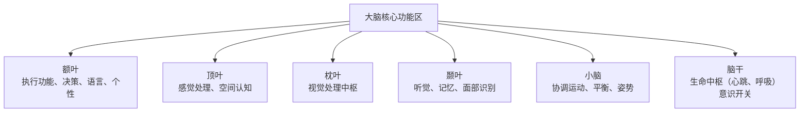

    Reinforcement Learning :: Right Left
    Input Output :: Front Back 
    Platform Funk :: Up Down 
    
    Sphere 4D XYZT geodesic 
    Calabi-yau 6D manifold 
    xxXyyYzzZ Small middle Big 

    26 + 26 + 26 = 78 letter
    based on 5202 62 7

好的，这是一个非常有趣且常见的简化模型，主要用于帮助理解大脑的主要功能分区。根据神经科学的常见分类，除了连接两侧大脑半球的**胼胝体**和内分泌腺体**松果体**外，我们可以将大脑的核心功能区分为以下六个主要区域：
下图直观地展示了这六个核心脑区及其主要功能：

---

### 六个主要脑区详解

1.  **额叶 (Frontal Lobe)**
    *   **位置**：位于大脑最前端，是大脑中占比最大的脑叶。
    *   **核心功能**：
        *   **高级认知功能**：如推理、计划、解决问题、决策（执行功能）。
        *   **自主运动控制**：通过初级运动皮层发出运动指令。
        *   **语言**：大多数人的语言表达中枢（布罗卡区）位于左侧额叶。
        *   **个性与情绪**：参与调节情绪和社会行为。

2.  **顶叶 (Parietal Lobe)**
    *   **位置**：位于额叶之后，枕叶之前。
    *   **核心功能**：
        *   **体感处理**：接收并处理来自身体的触觉、温度、疼痛等感觉信息（初级体感皮层）。
        *   **空间认知**：帮助我们理解周围环境的空间关系，进行导航和感知自身在空间中的位置。
        *   **整合信息**：整合来自视觉、听觉和体感的信息。

3.  **枕叶 (Occipital Lobe)**
    *   **位置**：位于大脑后部。
    *   **核心功能**：
        *   **视觉处理中枢**：专门处理视觉信息。接收来自眼睛的信号，并解析其颜色、形状、运动等。
        *   **损伤影响**：枕叶受损会导致各种视觉问题，甚至失明。

4.  **颞叶 (Temporal Lobe)**
    *   **位置**：位于大脑两侧，耳朵上方。
    *   **核心功能**：
        *   **听觉处理**：处理听觉信息（初级听觉皮层）。
        *   **记忆**：尤其是长期记忆的形成和储存，与其中的海马体结构密切相关。
        *   **语言理解**：大多数人的语言理解中枢（韦尼克区）位于左侧颞叶。
        *   **物体和面部识别**：参与识别复杂的视觉刺激，如面孔和物体。

5.  **小脑 (Cerebellum)**
    *   **位置**：位于大脑后方、脑干之上，形状像一个小型的脑。
    *   **核心功能**：
        *   **运动协调与平衡**：非自主性地协调肌肉运动，确保动作平滑、准确，并维持身体平衡。
        *   **运动学习**：参与学习新的运动技能，如弹琴或打球。
        *   **近年研究发现**：它可能还参与一些非运动功能，如注意力和语言处理。

6.  **脑干 (Brainstem)**
    *   **位置**：连接大脑、小脑和脊髓，是大脑最古老、最核心的部分。
    *   **核心功能**：维持生命的基本功能，是生命的“中枢开关”。
        *   **心跳和呼吸**：控制自主功能，如心跳、呼吸、血压。
        *   **意识循环**：调节睡眠-觉醒周期。
        *   **神经通路**：几乎所有连接大脑和身体的信息都必须经过脑干。

---

### 重要说明

*   **这是一个简化模型**：大脑的功能远比这个划分复杂，各个区域之间通过复杂的神经网络紧密协作，大多数高级功能（如学习、情绪）都需要多个脑区共同参与。
*   **边缘系统 (Limbic System)**：您可能会注意到这个模型中缺少了常被提及的“边缘系统”（包括海马体、杏仁核等）。这是因为边缘系统是一个功能性的概念，而非一个独立的解剖区域，其结构主要分布在**颞叶**深处及周围。如果强调情绪和记忆，边缘系统是关键。
*   **胼胝体和松果体**：正如您所排除的，胼胝体是连接左右半球的纤维束，松果体是分泌褪黑素的内分泌腺，它们通常不被列为独立的“功能区域”。

希望这个详细的分解能帮助您更好地理解大脑的功能分区！
